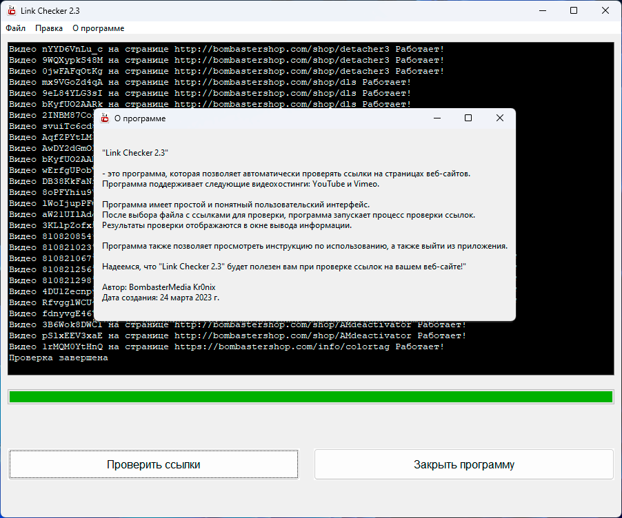

Hi there! Here's an example of a `readme.md` file description for your GitHub repository:

# Video Embed Checker

This is a simple Python checker that verifies the validity of video embeds on a website using frames.

## Usage

1. Add the list of website pages you want to check to the `links.txt` file.
2. Run the `checker.exe` script.
3. The checker will verify each video link. If the video is working, it will display "Working". If the link is invalid, the video has been removed, or for any other reason the link is not valid, it will display "Needs Replacement".

## Logging

The checker also includes a logging feature that allows you to save the verification results to a file for further analysis.

## License

This repository and the development are licensed under the license you can find in the `LICENSE` file. The author of this project and repository is [yasaxil](https://github.com/yasaxil).

Feel free to replace the author's GitHub profile link with your own if you're not [yasaxil]. Good luck with your repository!
